# Extensible evaluation architecture

## Repository audit

The repository originally implemented one complete, research-oriented benchmark rather than a general evaluation framework:

- `main.py` owns the OpenRouter client, two hard-coded models, one system prompt, generation settings, benchmark execution, pairwise judging, report generation, and the interactive CLI.
- `evaluation.py` provides deterministic exact/numeric comparison and JSON, YAML, CSV, and Markdown-table validation.
- `reporting.py` recalculates corrected metrics and aggregates results by model, category, difficulty, and provider.
- `database.py` creates and imports a denormalized run bundle into SQLite or Turso.
- `app.py` is a single-file Streamlit dashboard. There is no separate HTTP backend or frontend package.
- `benchmark_prompts.json` contains 120 newly authored Greek prompts inspired by public benchmark formats.
- `seed/llm_eval_seed.db` contains one completed two-model run.

This legacy path remains supported. The framework is an additive layer, not a rewrite.

## Target evaluation model

```text
Model × Task × Prompt Strategy × Dataset
    → versioned Evaluation Run
    → immutable per-example Results
    → task-specific + common Metrics
    → explicit Aggregations and Pareto comparisons
```

The architecture follows the scenario-oriented, multi-metric spirit of HELM without copying its implementation or collapsing all behavior into one universal score.

## Package boundaries

| Module | Responsibility |
|---|---|
| `llm_eval/domain.py` | Immutable domain entities and run/result snapshots |
| `llm_eval/catalog.py` | Versioned JSON catalog loading and legacy dataset adaptation |
| `llm_eval/registry.py` | Provider, task, prompt, evaluator, and metric extension points |
| `llm_eval/providers/` | Provider-neutral request/response contract and OpenAI-compatible/OpenRouter adapter |
| `llm_eval/evaluators.py` | Task evaluator contract and currently implemented deterministic evaluators |
| `llm_eval/metrics.py` | Common success, latency, token, cost, and throughput metrics |
| `llm_eval/aggregation.py` | Mean, median, standard deviation, totals, and explicit Pareto frontiers |
| `llm_eval/pipeline.py` | Reusable matrix orchestration with per-example failure isolation |
| `llm_eval/persistence.py` | Framework run snapshots and metric persistence |
| `catalog/` | Models, tasks, and versioned prompt strategies as data rather than code |
| `framework_cli.py` | Opt-in runner for the new framework |

The existing `main.py`, `app.py`, `evaluation.py`, and `reporting.py` remain available for the completed v1.1 benchmark.

## Domain concepts

### Model

Stores provider, provider model id, optional context window, optional input/output prices, reasoning support, and metadata. Runtime provider usage can override catalog price estimation.

### Task

Declares its task type, evaluator type, evaluator version, and supported metrics. The pipeline resolves the evaluator through the registry. A cataloged but unimplemented evaluator fails before any paid requests.

### Dataset and DatasetRecord

Datasets are keyed by `(dataset_id, version)` and belong to one task. Records retain language, difficulty, domain, reference values, variables, metadata, and provenance.

The framework CLI accepts either the legacy `benchmark_prompts.json` shape or a canonical dataset object containing `id`, `name`, `task_id`, `version`, provenance, and a `records` list. This allows new task datasets to be added without modifying the pipeline.

The current benchmark adapter marks every record as `newly_authored`. Benchmark names are retained only as inspiration metadata; the records are not represented as source data copied from HELM, GSM8K, or other benchmarks.

### PromptStrategy

Prompt strategies are keyed by `(strategy_id, version)` and store system prompt, user template, language, declared variables, and metadata. An existing id/version cannot be silently rewritten in persistence; a changed prompt requires a new version.

### RunSpec and EvaluationResult

`RunSpec` captures the selected model(s), task, dataset version, prompt strategy version(s), generation settings, metric configuration, and run metadata.

Each `EvaluationResult` keeps:

- raw input, output, and reference;
- rendered system and user prompt snapshots;
- model, task, dataset, prompt, generation-setting, evaluator, and metric-configuration snapshots;
- provider and resolved model id;
- status and error;
- usage, timings, and individual metric values.

This prevents historical runs from changing when catalogs are edited later.

## Pipeline

```mermaid
flowchart LR
    A[Resolve task and dataset version] --> B[Resolve prompt strategy versions]
    B --> C[Render immutable prompt snapshot]
    C --> D[Resolve provider adapter]
    D --> E[Generate and capture usage/timings]
    E --> F[Resolve task-specific evaluator]
    F --> G[Calculate common operational metrics]
    G --> H[Persist result and metric values]
    H --> I[Aggregate by model/task/prompt/difficulty]
```



Provider failures become failed per-example results. Configuration errors such as an evaluator-version mismatch stop the run before requests are made.

## Performance metric definitions

The common metric layer deliberately separates:

- `end_to_end_latency`: effective wall-clock time around the provider request, including retries and transport overhead;
- `effective_output_tokens_per_second`: output tokens divided by end-to-end latency;
- `generation_time`: provider-reported pure generation time, when available;
- `generation_output_tokens_per_second`: output tokens divided by provider-reported generation time;
- `time_to_first_token` and `inter_token_latency`: stored only when technically available;
- input, output, and total tokens;
- request cost and aggregate run cost.

Missing streaming/inference telemetry remains null. It is never inferred from end-to-end latency.

## Evaluator status

Implemented in the first framework slice:

- exact/normalized match;
- classification accuracy and label validity;
- structured syntax/schema/format compliance using the corrected legacy validators;
- legacy deterministic compatibility adapter.

Cataloged for later task-specific implementations:

- summarization and bullet-point rubrics;
- RAG/grounding and factuality;
- sandboxed code execution;
- spreadsheet/tabular cleaning;
- translation and Greek quality;
- long-context and document understanding;
- tool-use/agentic evaluation.

Planned evaluators are visible in the catalog but cannot be run until registered. This avoids publishing placeholder quality scores.

## Persistence and migrations

The legacy tables remain unchanged:

```text
runs, prompts, model_outputs, pairwise_judgments, judge_scores,
model_summary, category_summary, difficulty_summary, provider_summary,
human_review_sample, human_reviews
```

Migration `001_extensible_evaluation_framework` adds:

```text
models, tasks, datasets, dataset_records, prompt_strategies,
evaluation_runs, evaluation_run_models,
evaluation_run_prompt_strategies, evaluation_results, metric_values
```

`schema_migrations` records applied changes. The migration is additive and idempotent for both a new database and a copied legacy seed database.

## Implemented UI

The Streamlit application now provides a shared workflow navigation and three additive pages while preserving the legacy benchmark dashboard:

1. **Run Evaluation** — multi-model selection, task, dataset version, one or more compatible prompt strategy versions, safe generation defaults, exact request calculation, API-key validation, paid-run confirmation, and live progress.
2. **Framework Results** — model/prompt/difficulty filters, explicit task-quality metric selection, leaderboard, mean/median/std, telemetry, quality–cost Pareto view, and failure visibility.
3. **Example drill-down** — input, immutable rendered prompt, output, reference, individual metrics, and scoring metadata.
4. **Prompt Comparison** — same model and record side by side across prompt versions, with score/token/latency/cost deltas.

Planned UI follow-ups include durable background jobs, cancellation/resume, dataset management, and authoring/versioning prompts directly from the browser.

The UI should query the framework persistence layer or read models, never embed evaluator or provider logic in Streamlit callbacks.

## Incremental migration plan

1. Keep the existing benchmark dashboard and CLI operational.
2. Run new compatible task slices through `framework_cli.py` and validate framework results beside legacy results.
3. Add task-specific evaluators with fixture datasets and tests one at a time.
4. Add the Run Builder and general results pages on the framework tables.
5. Move the existing OpenRouter execution path behind the provider adapter after result parity is demonstrated.
6. Remove duplicated legacy aggregation helpers only after both paths produce equivalent corrected v1.1 reports.

## Verification

The test suite covers catalog loading, provenance status, registry errors, full matrix cardinality, prompt snapshots, deterministic result identifiers, evaluator version enforcement, provider failure isolation, throughput definitions, aggregate statistics, Pareto filtering, additive migrations, persistence, and prompt-version immutability.
