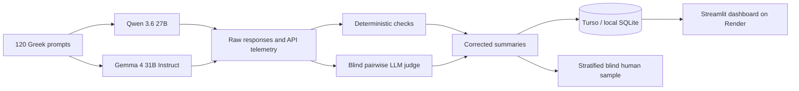

# Greek LLM Evaluation Platform

[](https://www.python.org/)
[](https://streamlit.io/)
[](https://turso.tech/)
[](https://render.com/)

A research-inspired evaluation platform for comparing large language models on **Greek-language tasks**. The current benchmark compares **Qwen 3.6 27B** and **Gemma 4 31B Instruct** using deterministic checks, a blind independent LLM judge, operational telemetry, and a stratified human-review sample.

### [Open the live dashboard](https://llm-evaluation-platform-f8ds.onrender.com)

> The public deployment is read-only. It displays the completed benchmark stored in Turso. Write operations such as saving human reviews or importing new runs are intended for local or private admin deployments with a write-enabled database token.

---

## Project overview

The platform evaluates model quality and operational performance through multiple complementary layers:

1. **API telemetry** — request success, latency, provider routing, tokens, retries, and recorded cost.
2. **Deterministic evaluation** — exact, normalized, contains, and numeric matching.
3. **Structured-output validation** — separate JSON, YAML, CSV, and Markdown-table checks.
4. **Blind LLM-as-a-judge evaluation** — randomized Answer A/B ordering with explicit ties.
5. **Blind human evaluation** — a balanced, stratified 30-prompt sample.

The benchmark contains **120 newly authored Greek prompts**. It is inspired by public evaluation methodologies rather than copied verbatim from benchmark datasets.

## Benchmark design

| Component | Design |
|---|---|
| Language | Greek |
| Total prompts | 120 |
| Categories | 10 |
| Prompts per category | 12 |
| Difficulty levels | 40 easy, 40 medium, 40 hard |
| Evaluated models | Qwen 3.6 27B, Gemma 4 31B Instruct |
| Model responses | 240 |
| Independent judge | GPT-4.1 mini |
| Pairwise judgments | 120 |
| Human-review sample | 30 stratified prompts |

### Task categories

- Instruction following
- Summarization
- Logical reasoning
- Mathematical reasoning
- Factuality and uncertainty
- Structured output
- Grounded question answering
- Greek-language quality
- Code generation and debugging
- Decision support and safety

The task formats draw inspiration from evaluation work such as **IFEval / M-IFEval, HELM, BIG-Bench Hard, GSM8K, TruthfulQA, and MT-Bench**.

## Evaluation architecture



## Headline results

Results below refer to the completed run `run_20260718_134525` and the corrected benchmark v1.1 reports.

| Metric | Qwen 3.6 27B | Gemma 4 31B Instruct |
|---|---:|---:|
| API success rate | 100% | 100% |
| Mean judge quality | **4.5917 / 5** | 4.5750 / 5 |
| Decisive pairwise wins | **36 / 60** | 24 / 60 |
| Judge task-success rate | 91.67% | **95.00%** |
| Judge hallucination rate | 3.33% | **0.83%** |
| Deterministic pass rate | 74.07% | **85.19%** |
| Structured syntax validity | 100% | 100% |
| Structured schema validity | **92.86%** | 78.57% |
| Strict structured-format compliance | **78.57%** | 28.57% |
| Mean latency | 9.468 s | **4.760 s** |
| P95 latency | 42.058 s | **14.839 s** |
| Recorded model cost | $0.080700 | **$0.010275** |

### Interpretation

- **Overall judge quality was effectively tied.** The difference between the two mean quality scores was very small.
- **Qwen won more decisive pairwise comparisons** and followed strict structured-output instructions more consistently.
- **Gemma was substantially faster and cheaper in this run**, while also achieving higher task success, a lower hallucination rate, and a stronger deterministic pass rate.
- Latency and cost are specific to the **OpenRouter providers selected during this run** and must not be interpreted as provider-independent properties of the models.

The benchmark is designed to support **use-case-specific model selection**, not to claim that one model is universally superior.

## Corrections in benchmark v1.1

The original 240 model responses and 120 judge evaluations were preserved. No model or judge API calls were repeated while producing the corrected reports.

Key corrections include:

- JSON validation now runs only when JSON output is explicitly required.
- JSON, YAML, CSV, and Markdown tables use separate syntax and schema checks.
- Strict output compliance checks instructions such as “only JSON” and rejects Markdown fences when prohibited.
- Exact-answer tasks distinguish strict, normalized, contains, and numeric comparison.
- Numeric evaluation supports decimal commas, percentages, and tolerances.
- The reference answer for `MR-H03` was corrected to approximately `20.7143%`.
- Raw `cannot_assess` judge labels are preserved and normalized only under explicit rules.
- The human sample was rebuilt with balanced category, difficulty, and A/B ordering.

See [CORRECTIONS.md](CORRECTIONS.md) for the detailed correction log.

## Dashboard features

The Streamlit dashboard provides:

- Corrected model-level summaries
- Quality analysis by category and difficulty
- Judge dimensions: correctness, instruction following, grounding, Greek quality, and overall quality
- Deterministic-answer diagnostics
- Structured-output syntax, schema, and formatting analysis
- Latency, token, cost, and provider-routing views
- Prompt-by-prompt response and judge-rationale explorer
- Stratified blind human-review workflow
- Human–judge agreement analysis
- Methodology and limitations section
- Local/admin import of completed benchmark runs

## Technology stack

- **Python**
- **Streamlit**
- **Pandas**
- **Plotly**
- **SQLite / libSQL**
- **Turso** for the hosted database
- **Render** for the public web service
- **OpenRouter** for model and judge API access
- **JSON Schema** and **PyYAML** for structured-output validation

## Repository structure

```text
.
├── app.py                    # Streamlit dashboard
├── main.py                   # Benchmark and independent-judge pipeline
├── evaluation.py             # Deterministic and structured-output checks
├── reporting.py              # Summaries, confidence intervals, human sample
├── database.py               # Local SQLite and remote Turso integration
├── rebuild_existing_run.py   # Rebuild reports without new API calls
├── benchmark_prompts.json    # 120-prompt Greek benchmark
├── seed/
│   └── llm_eval_seed.db      # Preloaded local demo database
├── render.yaml               # Free Render Blueprint configuration
├── DEPLOY_RENDER.md          # Deployment guide
├── CORRECTIONS.md            # Benchmark v1.1 correction log
├── requirements.txt
└── .env.example
```

## Run locally

### 1. Create the environment

```bash
python3 -m venv .venv
source .venv/bin/activate
python -m pip install --upgrade pip
python -m pip install -r requirements.txt
```

### 2. Configure environment variables

```bash
cp .env.example .env
```

For the preloaded local SQLite demo, no cloud database credentials are required. The first launch copies the seed database to `data/llm_eval.db`.

### 3. Start the dashboard

```bash
python -m streamlit run app.py
```

Open `http://localhost:8501`.

## Environment variables

| Variable | Required | Purpose |
|---|---|---|
| `OPENROUTER_API_KEY` | Only for new benchmark runs | Calls the evaluated models and independent judge |
| `JUDGE_MODEL` | Optional | Independent judge model; defaults to GPT-4.1 mini |
| `DATABASE_PATH` | Optional | Local SQLite database path |
| `TURSO_DATABASE_URL` | Hosted mode | Remote Turso/libSQL database URL |
| `TURSO_AUTH_TOKEN` | Hosted mode | Turso authentication token |
| `REQUEST_TIMEOUT_SECONDS` | Optional | API request timeout |
| `MAX_API_RETRIES` | Optional | Maximum API retries |
| `BENCHMARK_MAX_WORKERS` | Optional | Parallel benchmark workers |

Never commit `.env`, API keys, or database tokens.

## Run a new benchmark

Add an OpenRouter API key to `.env`, then run:

```bash
python main.py
```

The CLI supports:

1. Full benchmark followed by independent judging
2. Benchmark-only execution
3. Judging an existing run
4. Connection testing

A complete two-model run includes up to **240 model requests** and **120 judge requests**.

## Rebuild an existing run without API calls

Correct deterministic metrics, regenerate reports, create the stratified human sample, and import the run into SQLite:

```bash
python rebuild_existing_run.py \
  --run-id run_YYYYMMDD_HHMMSS \
  --source-dir results \
  --output-dir results \
  --database data/llm_eval.db
```

This process uses the existing raw model responses and pairwise judgments and does not repeat API requests.

## Deployment

The public dashboard is deployed on Render and reads the completed benchmark from Turso.

Required Render environment variables:

```text
TURSO_DATABASE_URL
TURSO_AUTH_TOKEN
```

For a public read-only dashboard, use a **read-only Turso token**. Detailed instructions are available in [DEPLOY_RENDER.md](DEPLOY_RENDER.md).

## Methodological limitations

- Only one generation was collected per prompt and model, so generation variance was not estimated.
- The judge is itself an LLM and may exhibit preference, style, or verbosity bias.
- Pairwise results should be complemented with the blind human-review sample.
- Model latency and cost depend on provider routing and runtime conditions.
- The benchmark is Greek-focused and task-distribution-specific.
- Results should not be generalized to every domain, prompt style, deployment route, or model configuration.

## Author

**Afroditi Tzama**

This project was developed as a practical study of reproducible LLM benchmarking, model selection, structured-output reliability, and evaluation-dashboard engineering.
